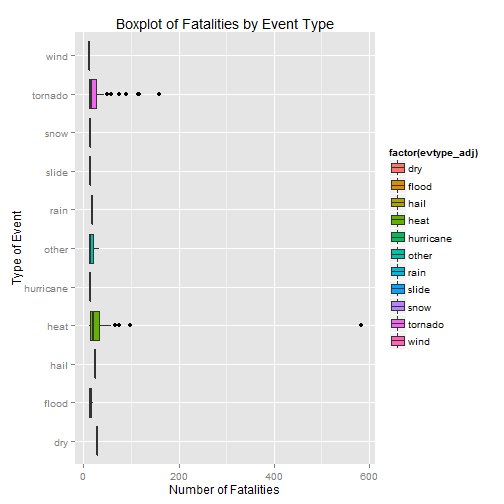

In evaluating the U.S. National Oceanic and Atmospheric Administration's (NOAA) storm database, we can see that tornados and heat-related events have the most damaging effect on population health in terms of injuries and fatalities. The most fatal weather event reported was a heat wave in 1995 in Illinois with ***583 fatalities*** associated with the event. Suprisingly, no injuries were reported with this deadly 4 day heat wave, perhaps due to data collection difficulties more than anything else. When evaluating overall economic effects, floods and hurricanes had the largest overall effect. Floods are the most frequent type of weather event experienced, and have caused significant cumulative economic damage over the course time frame of the data set (1950 to 2011). Hurricanes are much more infrequent, but have a devastating economic impact.

##Data Processing

I'll start by loading all of the packages that will be used in the analysis.


```r
library(ggplot2)
library(lubridate)
library(plyr)
```

```
## 
## Attaching package: 'plyr'
## 
## The following object is masked from 'package:lubridate':
## 
##     here
```

```r
library(reshape2)
library(gridExtra)
```

```
## Loading required package: grid
```

```r
library(lattice)
```

Next I'll load the storm database and manipulate the date variables to get them into the proper date format.


```r
data <- read.csv('repdata-data-StormData.csv',stringsAsFactors=FALSE)
names(data) <- tolower(names(data))
data$bgn_date <- mdy(sapply(data$bgn_date,gsub,pattern=' 0:00:00',replacement=''))
data$end_date <- mdy(sapply(data$end_date,gsub,pattern=' 0:00:00',replacement=''))
```

####Weather Event Encoding Adjustments

Given we'll be using the weather event type variable to assess their effect, I want to start by getting a sense of how the variable is encoded. According to the supporting documentation, there should only be ~50 event types encoded here.


```r
length(unique(data$evtype))
```

```
## [1] 985
```

Looks like we have 935 event types encoded here, much higher than what we expected. Let's take a quick look at the number of ways a heat-related event might be encoded.


```r
unique(data$evtype[grep("H[Ee][Aa][Tt]",data$evtype)])
```

```
##  [1] "HEAT"                   "EXTREME HEAT"          
##  [3] "EXCESSIVE HEAT"         "RECORD HEAT"           
##  [5] "HEAT WAVE"              "DROUGHT/EXCESSIVE HEAT"
##  [7] "RECORD HEAT WAVE"       "RECORD/EXCESSIVE HEAT" 
##  [9] "HEAT WAVES"             "HEAT WAVE DROUGHT"     
## [11] "HEAT/DROUGHT"           "HEAT DROUGHT"          
## [13] "Heatburst"              "Record Heat"           
## [15] "Heat Wave"              "EXCESSIVE HEAT/DROUGHT"
```

Now we know there's an issue with the various ways weather events have been encoded. We'll have to address this before we can begin our analysis. Let's quickly check the most damaging weather events by injuries and fatalities to see how we may want to group these weather event types.


```r
data[order(data$fatalities,decreasing=TRUE),c('bgn_date','state','evtype','injuries','fatalities')][1:10,]
```

```
##          bgn_date state         evtype injuries fatalities
## 198704 1995-07-12    IL           HEAT        0        583
## 862634 2011-05-22    MO        TORNADO     1150        158
## 68670  1953-06-08    MI        TORNADO      785        116
## 148852 1953-05-11    TX        TORNADO      597        114
## 355128 1999-07-28    IL EXCESSIVE HEAT        0         99
## 67884  1953-06-09    MA        TORNADO     1228         90
## 46309  1955-05-25    KS        TORNADO      270         75
## 371112 1999-07-04    PA EXCESSIVE HEAT      135         74
## 230927 1995-07-01    PA EXCESSIVE HEAT        0         67
## 78567  1966-03-03    MS        TORNADO      504         57
```

```r
data[order(data$injuries,decreasing=TRUE),c('bgn_date','state','evtype','injuries','fatalities')][1:10,]
```

```
##          bgn_date state            evtype injuries fatalities
## 157885 1979-04-10    TX           TORNADO     1700         42
## 223449 1994-02-08    OH         ICE STORM     1568          1
## 67884  1953-06-09    MA           TORNADO     1228         90
## 116011 1974-04-03    OH           TORNADO     1150         36
## 862634 2011-05-22    MO           TORNADO     1150        158
## 344159 1998-10-17    TX             FLOOD      800          2
## 860386 2011-04-27    AL           TORNADO      800         44
## 68670  1953-06-08    MI           TORNADO      785        116
## 529351 2004-08-13    FL HURRICANE/TYPHOON      780          7
## 344178 1998-10-17    TX             FLOOD      750          0
```

As we can see, tornados and exessive heat are prominent on the list. We'll want to make sure these are included in our weather event type grouping. 

Next I'll create and adjusted event type variable that seeks to remove a lot of the encoding issues we can see in the original event type variable.


```r
data$evtype <- tolower(data$evtype)
data$evtype_adj <- data$evtype

data$evtype_adj[which(grepl("tornado",data$evtype))] <- 'tornado'
data$evtype_adj[which(grepl("heat",data$evtype))] <- 'heat'
data$evtype_adj[which(grepl("warm",data$evtype))] <- 'heat'
data$evtype_adj[which(grepl("blizzard",data$evtype))] <- 'blizzard'
data$evtype_adj[which(grepl("coastal",data$evtype))] <- 'coastal'
data$evtype_adj[which(grepl("cold",data$evtype))] <- 'cold'
data$evtype_adj[which(grepl("dry",data$evtype))] <- 'dry'
data$evtype_adj[which(grepl("wind",data$evtype))] <- 'wind'
data$evtype_adj[which(grepl("flood",data$evtype))] <- 'flood'
data$evtype_adj[which(grepl("freez",data$evtype))] <- 'freeze'
data$evtype_adj[which(grepl("hail",data$evtype))] <- 'hail'
data$evtype_adj[which(grepl("rain",data$evtype))] <- 'rain'
data$evtype_adj[which(grepl("snow",data$evtype))] <- 'snow'
data$evtype_adj[which(grepl("hurricane",data$evtype))] <- 'hurricane'
data$evtype_adj[which(grepl("ice",data$evtype))] <- 'ice'
data$evtype_adj[which(grepl("lightning",data$evtype))] <- 'lightning'
data$evtype_adj[which(grepl("slide",data$evtype))] <- 'slide'
data$evtype_adj[which(grepl("thunderstorm",data$evtype))] <- 'thunderstorm'
data$evtype_adj[which(grepl("sleet",data$evtype))] <- 'sleet'
data$evtype_adj[which(grepl("waterspout",data$evtype))] <- 'waterspout'
```

Now we've grouped the most popular weather event types into our adjusted variable, and I'm going to add an additional 'other' category to finalize our groupings.


```r
data$evtype_adj[which(!(data$evtype_adj %in% c('waterspout','sleet','thunderstorm',
                                               'slide','lightning','ice','hurricane',
                                               'snow','rain','hail','freeze','flood',
                                               'wind','dry','cold','coastal','blizzard',
                                               'heat','tornado')))] <- 'other'
table(data$evtype_adj)
```

```
## 
##     blizzard      coastal         cold          dry        flood 
##         2724           14          900          301        82673 
##       freeze         hail         heat    hurricane          ice 
##         1516       290312         2961          288         2194 
##    lightning        other         rain        sleet        slide 
##        15765        43656        12174          122          652 
##         snow thunderstorm      tornado   waterspout         wind 
##        17594       109572        60684         3861       254334
```

Now let's look again at the most dangerous weather events with our adjusted variable.


```r
data[order(data$fatalities,decreasing=TRUE),c('bgn_date','state','evtype_adj','injuries','fatalities')][1:10,]
```

```
##          bgn_date state evtype_adj injuries fatalities
## 198704 1995-07-12    IL       heat        0        583
## 862634 2011-05-22    MO    tornado     1150        158
## 68670  1953-06-08    MI    tornado      785        116
## 148852 1953-05-11    TX    tornado      597        114
## 355128 1999-07-28    IL       heat        0         99
## 67884  1953-06-09    MA    tornado     1228         90
## 46309  1955-05-25    KS    tornado      270         75
## 371112 1999-07-04    PA       heat      135         74
## 230927 1995-07-01    PA       heat        0         67
## 78567  1966-03-03    MS    tornado      504         57
```

```r
data[order(data$injuries,decreasing=TRUE),c('bgn_date','state','evtype_adj','injuries','fatalities')][1:10,]
```

```
##          bgn_date state evtype_adj injuries fatalities
## 157885 1979-04-10    TX    tornado     1700         42
## 223449 1994-02-08    OH        ice     1568          1
## 67884  1953-06-09    MA    tornado     1228         90
## 116011 1974-04-03    OH    tornado     1150         36
## 862634 2011-05-22    MO    tornado     1150        158
## 344159 1998-10-17    TX      flood      800          2
## 860386 2011-04-27    AL    tornado      800         44
## 68670  1953-06-08    MI    tornado      785        116
## 529351 2004-08-13    FL  hurricane      780          7
## 344178 1998-10-17    TX      flood      750          0
```

##Results

####Weather Events and Population Health

We've seen a bit about the what types of events have caused the greatest damage to population health, now we'll dive into this a bit deeper. First we'll look at how many time each weather event type caused over 100 injuries.


```r
table(data$evtype_adj[data$injuries > 100])
```

```
## 
##  blizzard      cold     flood      hail      heat hurricane       ice 
##         2         1        13         1        26         3         1 
##     other      snow   tornado 
##         5         1       137
```

As we saw previsouly, tornados and heat-related weather events frequently lead to high injury numbers. 

Now I'll display a boxplot of the most damaging weather events and the injuries associated with them. Note that the boxplot only displays weather events with more than 100 associated injuries.


```r
ggplot(data[data$injuries > 100,],aes(evtype_adj,injuries)) + 
  geom_boxplot(aes(fill=factor(evtype_adj))) +
  coord_flip() + 
  xlab('Type of Event') + 
  ylab('Number of Injuries') + 
  ggtitle('Boxplot of Injuries by Event Type')
```

 

Now with the data displayed in a bit more depth, we can see that floods and hurricanes also can cause significant numbers of injuries when they occur. It also looks like we have a single ice-related event that led to over 1500 injuries.

Now we'll look at weather events that led to over 10 fatalities.


```r
table(data$evtype_adj[data$fatalities > 10])
```

```
## 
##       dry     flood      hail      heat hurricane     other      rain 
##         1         5         1        42         2         6         1 
##     slide      snow   tornado      wind 
##         1         1        96         1
```

And now a boxplot of events with more than 10 associated fatalities.


```r
ggplot(data[data$fatalities > 10,],aes(evtype_adj,fatalities)) + 
  geom_boxplot(aes(fill=factor(evtype_adj))) +
  coord_flip() +
  xlab('Type of Event') + 
  ylab('Number of Fatalities') + 
  ggtitle('Boxplot of Fatalities by Event Type')
```

 

As expected, tornodos and heat-related weather events can lead to significant numbers of fatalities. Suprisingly, we can also see single rain and hail weather events that have led to 19 and 25 fatalities respectively.

##Weather Events and Economic Impact

Now we'll move on to evaluating the economic impact of various weather event types. First we need to adjust the damage exponent/multiplier variables included in the storm database to properly evaluate overall economic impact.


```r
data$cropdmgexp_cor <- data$cropdmgexp
data$cropdmgexp_cor[!(data$cropdmgexp %in% c('H','h','K','k','M','m','B','b'))] <- '1'
data$cropdmgexp_cor[data$cropdmgexp == 'H'] <- '100'
data$cropdmgexp_cor[data$cropdmgexp == 'h'] <- '100'
data$cropdmgexp_cor[data$cropdmgexp == 'M'] <- '1000000'
data$cropdmgexp_cor[data$cropdmgexp == 'm'] <- '1000000'
data$cropdmgexp_cor[data$cropdmgexp == 'K'] <- '1000'
data$cropdmgexp_cor[data$cropdmgexp == 'k'] <- '1000'
data$cropdmgexp_cor[data$cropdmgexp == 'B'] <- '1000000000'
data$cropdmgexp_cor[data$cropdmgexp == 'b'] <- '1000000000'

data$cropdmgexp_cor <- as.numeric(data$cropdmgexp_cor)

data$propdmgexp_cor <- data$propdmgexp
data$propdmgexp_cor[!(data$propdmgexp %in% c('H','h','K','k','M','m','B','b'))] <- '1'
data$propdmgexp_cor[data$propdmgexp == 'H'] <- '100'
data$propdmgexp_cor[data$propdmgexp == 'h'] <- '100'
data$propdmgexp_cor[data$propdmgexp == 'M'] <- '1000000'
data$propdmgexp_cor[data$propdmgexp == 'm'] <- '1000000'
data$propdmgexp_cor[data$propdmgexp == 'K'] <- '1000'
data$propdmgexp_cor[data$propdmgexp == 'k'] <- '1000'
data$propdmgexp_cor[data$propdmgexp == 'B'] <- '1000000000'
data$propdmgexp_cor[data$propdmgexp == 'b'] <- '1000000000'

data$propdmgexp_cor <- as.numeric(data$propdmgexp_cor)
```

Next I'll create a calculated variable to measure total economic impact.


```r
data$totaldmg <- data$propdmg*data$propdmgexp_cor + data$cropdmg*data$cropdmgexp_cor
```

Next I'll set up two separate data sets indicating the total and average economic damage by event type.


```r
data.melt <- melt(data,id=c('evtype_adj','state'),measure.vars=c('injuries','fatalities','totaldmg'))
data.event.mean.dcast <- dcast(data.melt,evtype_adj ~ variable,mean)
data.event.sum.dcast <- dcast(data.melt,evtype_adj ~ variable,sum)
```

Now that we have our data sets ready to display total and average economic damage by weather event type, lets plot these 2 values to compare.


```r
p1 <- ggplot(data.event.sum.dcast, aes(x=evtype_adj,y=totaldmg)) + 
  geom_bar(stat='identity') +
  coord_flip() +
  xlab('Type of Weather Event') +
  ylab('Total Economic Impact') +
  ggtitle('Total Economic Impact')
p2 <- ggplot(data.event.mean.dcast, aes(x=evtype_adj,y=totaldmg)) + 
  geom_bar(stat='identity') +
  coord_flip() +
  xlab('Type of Weather Event') +
  ylab('Average Economic Impact') +
  ggtitle('Average Economic Impact')
grid.arrange(p1,p2,ncol=2)
```

 

Here we can see that floods, because they occur often, have inflicted heavy economic damage over the timeline of the storm database. However, when looking at the average economic impact, we can see the remarkable devastation that hurricanes can cause when they occur. 

Another thing to note here is total damage caused by events in my defined 'other' category. I may want to revisit the technique used to group these variables to make sure I'm not missing important data points.
